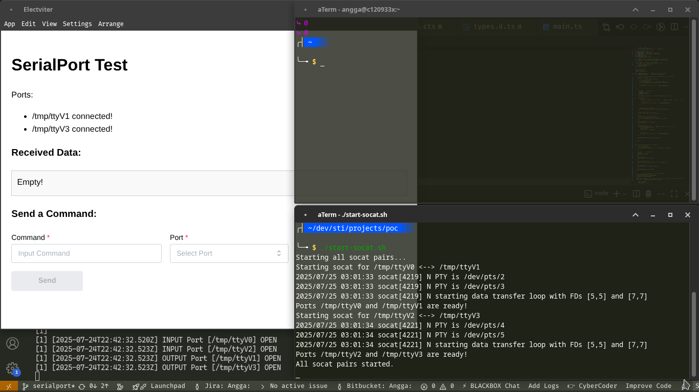
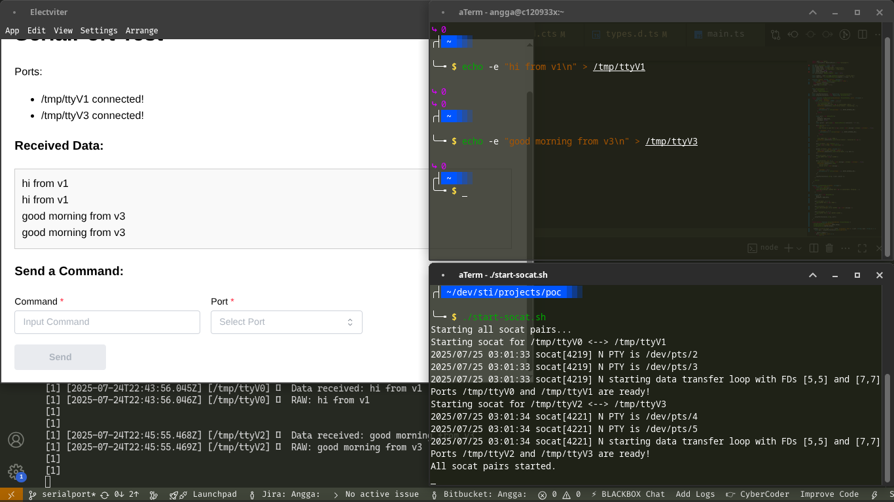
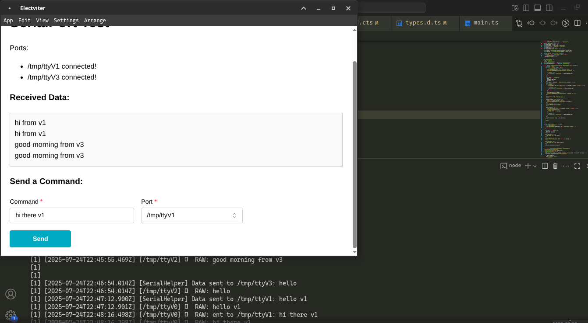

# ✨ ELECTVITER

This project demonstrates how to use Electron in conjunction with serialport to communicate with virtual serial devices created using socat. The application opens one or more serial ports and sends/receives data through them. Socat is used to create virtual serial port pairs (PTY) that simulate physical serial communication, allowing data to be exchanged between Electron and external tools or terminal sessions.

## 📁 Project Structure

```bash
electviter/
├── assets/ # Static assets (images, fonts, etc.)
├── config/ # TS Configuration
│   └── tsconfig.base.json
│
├── main/   # Electron main process
│   ├── modules/
│   │   ├── menu.ts
│   │   ├── serial.ts
│   │   └── tray.ts
│   ├── utils/
│   │   ├── env.ts
│   │   ├── os.ts
│   │   └── path.ts
│   ├── main.ts
│   ├── preload.ts
│   ├── README.md
│   └── tsconfig.json
│
├── renderer/ # Electron renderer process
│   ├── components/
│   ├── contexts/
│   ├── App.css
│   ├── App.tsx
│   ├── index.tsx
│   ├── styles.css
│   └── README.md
│
├── electron-builder.json
├── index.html
├── package.json
├── post.css.ts
├── README.md
├── tsconfig.app.json
├── tsconfig.json
├── tsconfig.node.json
├── types.d.ts
└── vite.config.ts
```

## Prerequisites

Before running this application, ensure the following tools are installed on your system:

### 1. `socat` – Virtual Serial Port Bridge

Used to create linked pairs of pseudo-terminals (PTY) that behave like serial ports.

- **Linux (Debian/Ubuntu)**:
  ```bash
  sudo apt-get install socat
  ```
- macOS (via Homebrew):

  ```bash
  brew install socat
  ```

- Windows: Download the Windows binary from socat's website, or use Cygwin to install it.

### 2. screen – Serial Terminal Tool

Used to send or read data from the virtual ports manually.

- Linux:

  ```bash
  sudo apt install screen
  ```

- macOS:

  ```bash
  brew install screen
  ```

- Windows: Use WSL, Git Bash, or install via Cygwin

## 🚀 Getting Started

### 1. Clone the Repository

Clone the project repository to your local machine.

```bash
git clone https://github.com/anggarobo/electviter.git
cd electviter
```

### 2. Install Dependencies

Install the necessary Node.js dependencies.

```bash
pnpm install
```

This will install Electron and serialport required for the application to work.

### 3. Start Virtual Serial Ports using socat

Run this command in Terminal 1:

**For Linux & macOS**

```bash
# First pair: /tmp/ttyV0 <--> /tmp/ttyV1
socat -d -d PTY,raw,echo=0,link=/tmp/ttyV0 PTY,raw,echo=0,link=/tmp/ttyV1 &

# Second pair: /tmp/ttyV2 <--> /tmp/ttyV3
socat -d -d PTY,raw,echo=0,link=/tmp/ttyV2 PTY,raw,echo=0,link=/tmp/ttyV3 &
```

**For Windows (WSL or Git Bash)**

```bash
# Run these inside WSL or Git Bash (must support /tmp and socat)
socat -d -d PTY,raw,echo=0,link=/tmp/ttyV0 PTY,raw,echo=0,link=/tmp/ttyV1 &
socat -d -d PTY,raw,echo=0,link=/tmp/ttyV2 PTY,raw,echo=0,link=/tmp/ttyV3 &
```

The script will start two socat bridges:

- `/tmp/ttyV0` ↔ `/tmp/ttyV1`

- `/tmp/ttyV2` ↔ `/tmp/ttyV3`

> These pairs are bidirectional. Sending to one end will deliver data to the other.

Example output:

```bash
/tmp/ttyV0 <--> /tmp/ttyV1
/tmp/ttyV2 <--> /tmp/ttyV3
```

### 4. Send Manual Data to Electron

The Electron app listens to /tmp/ttyV3 by default.

To simulate incoming data, use this command in Terminal 2:

```bash

echo -e "hi from v3\n" > /tmp/ttyV3
```

> The message "hi from v3" will be received and logged by the Electron app (via /tmp/ttyV2 ↔ /tmp/ttyV3).

Alternatively, you can use screen to send messages manually:

```bash
screen /tmp/ttyV3 9600
```

To exit screen:

Press Ctrl + A, then K, then confirm with Y

### 5. Run the Electron App

In Terminal 3, run the app in development mode:

```bash
pnpm run dev
```

The app will:

- Open a window
- Connect to the serial port /tmp/ttyV3
- Log connection status
- Send ping messages every 5 seconds
- Listen for incoming data

Example logs:

```bash
[SerialHelper] Serial port /tmp/ttyV3 TERBUKA
[SerialHelper] Data terkirim: Ping from Renderer!
[SerialHelper] Data masuk: hi from v3
```

### 6. Observe the Flow

This setup enables a full loop:

- Electron app opens /tmp/ttyV3
- socat links /tmp/ttyV2 ↔ /tmp/ttyV3
- You write to /tmp/ttyV3 → Electron receives on /tmp/ttyV3

You may also interact with the other pair (/tmp/ttyV0 ↔ /tmp/ttyV1) the same way.

### 7. Troubleshooting

- Port busy?

```bash
lsof /tmp/ttyV3
```

- Terminate stuck processes:

```bash
pkill socat
pkill screen
```

- [Restart socat](#3-start-virtual-serial-ports-using-socat)

## 📦 Building & Packaging

To package the application into a distributable format (e.g., .msi, .AppImage, .dmg, etc.):

Mac

```bash
pnpm run dist:mac
```

Linux

```bash
pnpm run dist:linux
```

Windows

```bash
pnpm run dist:win
```

## Summary

| Component     | Role                                     |
| ------------- | ---------------------------------------- |
| Electron      | Serial port client (receiver/sender)     |
| socat Creates | linked virtual serial ports              |
| /tmp/ttyV3    | Port opened by Electron (via serialport) |
| /tmp/ttyV2    | Port you send data to (test simulator)   |

## Screenshot





## 📚 References

- [Vite Documentation](https://vite.dev/guide/)
- [Electron Main Process API](https://www.electronjs.org/docs/latest/api/app)
- [SerialPort](https://serialport.io/)
- [TypeScript Documentation](https://www.typescriptlang.org/docs/)
- [React Documentation](https://react.dev/)
- [pnpm Documentation](https://pnpm.js.org/docs/)

## License

MIT © 2025 [anggarobo](https://github.com/anggarobo/)
